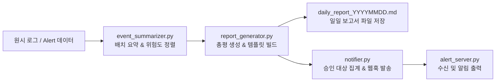

`agent_core/README.md`로 바로 복사해서 붙여넣을 수 있는 마크다운 문서입니다.

난잡하게 섞여 있던 주피터 노트북, 파이썬 모듈, 설정값, 데이터 및 산출물 파일들을 기능별로 깔끔하게 분류하고, 실행 방법과 아키텍처 다이어그램까지 갖추어 작성했습니다.

---

# 🛡️ Agent Core: AI 기반 보안 관제 자동화 파이프라인

본 디렉터리는 로그 수집 및 탐지, LLM 기반 이상 징후 분석, 일일 보안 보고서 마크다운 생성, 웹훅 알림 발송까지의 전 과정을 자동화하는 **보안 관제 파이프라인(Agent Core)** 핵심 모듈을 포함하고 있습니다.

---

## 📌 전체 파이프라인 구조 (Pipeline Architecture)



---

## 📂 파일 구조 및 역할 분류

디렉터리 내 파일들을 기능과 용도에 따라 5가지 영역으로 분류했습니다.

### 1. ⚙️ 파이프라인 핵심 모듈 (Python Core)

파이프라인을 구성하고 실제로 실행되는 파이썬 소스 코드입니다.

* **`pipeline.py`**: 전체 파이프라인의 **엔트리 포인트(Entry Point)**. 설정 검증, 요약, 보고서 빌드, 웹훅 알림을 하나의 명령어로 오케스트레이션합니다.


* **`event_summarizer.py`**: 대량의 경보를 6건 단위 배치로 분할 요약하고, `high` ➔ `medium` ➔ `low` 순서로 정렬합니다.


* **`report_generator.py`**: 프롬프트 체이닝을 통해 총평을 생성하고 고정 템플릿에 맞추어 일일 마크다운 보고서를 조립·저장합니다.


* **`llm_client.py`**: Gemini API 호출 래퍼 모듈로, 마크다운 태그를 정제하고 안전한 JSON 파싱을 수행합니다.


* **`notifier.py`**: 설정 파일 검증(`load_config`), 위험도 판정(`needs_approval`), 타임아웃 및 장애 허용을 적용한 알림 발송(`notify_safe`)을 담당합니다.


* **`alert_server.py`**: 로컬 테스트용 Flask 웹훅 수신 서버입니다 (`/alert` 엔드포인트).


* **`tool_router.py`**: AI 에이전트의 도구 레지스트리와 함수 호출 라우터입니다.


* **`scheduler_job.py`**: `schedule` 라이브러리를 통해 일정 주기마다 미처리 Alert를 감시하고 전송하는 배치 모듈입니다.


* **`webhook_server_pm.py`**: Alert 수신 및 파일 저장을 검증하기 위한 웹훅 서버입니다.


---

### 2. 🔧 환경 설정 및 정책 (Configurations)

코드 수정 없이 동작 정책과 환경을 변경하기 위한 JSON 설정 파일입니다.

* **`config.json`**: 메인 운영 설정 파일 (사용 LLM 모델, 사람 승인 위험도 기준, 보고서 저장 폴더, 웹훅 URL).


* **`config_medium.json`**: 승인 정책 기준을 `medium`으로 조정한 설정 파일입니다.
* **`config_off.json`**: 알림 서버 장애 상황을 테스트하기 위해 존재하지 않는 포트(5999)로 지정된 테스트용 설정 파일입니다.


* **`config_broken.json`**: 필수 키 누락 시 파이프라인의 사전 차단(`load_config`) 동작을 검증하기 위한 결함 설정 파일입니다.


---

### 3. 📊 입력 데이터 및 영속성 관리 (Data & State)

* **로그 및 원천 이벤트 데이터**:
* `raw_logs.txt`: 가공되지 않은 텍스트 로그 파일.


* `normalized_logs.json`: 정규화 처리가 완료된 구조화 로그 데이터.


* `events_1007.json` / `events_1008.json`: 날짜별 관제 대상 Alert 샘플 데이터.


* **상태 및 중간 결과물**:
* `processed_ids.json`: 중복 발송 방지 및 멱등성(Idempotency) 보장을 위해 발송 완료된 이벤트 ID를 기록한 파일.


* `event_summaries.json` / `sorted_summaries.json`: LLM 요약 결과 및 위험도 정렬 완료 데이터.


* `received_alerts.json`: 웹훅 수신 서버가 정상 접수한 경보 내역.


* `agent_result.json`: 에이전트 도구 실행 내역 및 승인 게이트 보류(`held`) 감사 기록.


* `alert_failures.log`: 알림 발송 실패 시 남겨지는 로그 기록.


---

### 4. 📄 최종 산출물 (Output Reports)

파이프라인 실행을 통해 자동 빌드된 일일 관제 보고서입니다.

* **`daily_report_20261007.md`**: 10월 7일 야간 관제 보고서.


* **`daily_report_20261008.md`**: 10월 8일 야간 관제 보고서.


* **`daily_report_20261009.md`**: 장애 허용 테스트 검증용 보고서.


* **`reports/`**: 파이프라인 설정에 따라 보고서가 집합 저장되는 디렉터리.


---

### 5. 📓 학습 실습 노트북 (Jupyter Notebooks)

기초 문법부터 파이프라인 구축까지 단계별로 진행한 실습 및 과제 기록입니다.

| 분류 | 노트북 파일명 | 학습 내용 요약 |
| --- | --- | --- |
| **기초 문법/로그** | `260923_...ipynb` 시리즈 | 조건문, 반복문, 함수, CSV 및 파일 핸들링

 |
| **예외/정규식/API** | `01_0928_...`, `01_0929_...`, `01_0930_...` | 정규식 탐지 룰, 중첩 JSON 파싱, API 클라이언트

 |
| **웹훅/스케줄러** | `261002_am_webhook_cli.ipynb`<br>

<br>`261002_pm_trigger_scheduler.ipynb` | Flask 웹훅 엔드포인트, CLI 인자 처리, `schedule` 기반 배치 실행

 |
| **LLM & 에이전트** | `261006_am_llm_prompt.ipynb`<br>

<br>`261006_pm_agent_tools.ipynb` | 프롬프트 구조화, Few-shot, 도구 호출(Tool Calling), 승인 게이트

 |
| **요약 & 보고서** | `261007_am_report_summary.ipynb`<br>

<br>`261007_pm_report_generator.ipynb` | 묶음 요약, 트리아지 정렬, 프롬프트 체이닝, 일일 보고서 생성

 |
| **통합 파이프라인** | `261008_am_config_pipeline.ipynb`<br>

<br>`261008_pm_review_debug_retro.ipynb` | 설정 분리, 웹훅 연동 오케스트레이션, 코드 리뷰, 단위 테스트 및 디버깅

 |

> 💡 *참고: `.bak` 확장자가 붙은 파일은 git pull 동기화 과정에서 생성된 임시 백업본입니다.*

---

## 🚀 빠른 실행 가이드 (Quick Start)

### 1. 환경 설정

프로젝트 루트의 `.env` 파일에 발급받은 Gemini API 키가 등록되어 있어야 합니다.

```text
GEMINI_API_KEY=AIzaSy...

```

### 2. 알림 수신 서버 실행 (터미널 1)

알림 웹훅을 수신할 로컬 서버를 백그라운드로 띄웁니다.

```bash
python alert_server.py

```

### 3. 관제 파이프라인 가동 (터미널 2)

통합 파이프라인을 단일 명령어로 실행합니다.

```bash
python pipeline.py

```

* 실행 결과로 `daily_report_YYYYMMDD.md`가 생성되고, 터미널 1(알림 서버)에 `[알림 받음]` 메시지가 출력됩니다.


---

## 🛡️ 핵심 설계 원칙

1. **설정 분리 (Decoupling Configuration):** API 키는 `.env`로 격리하고 일반 설정 및 정책은 `config.json`으로 분리하여 소스 코드 수정 없이 환경을 제어합니다.


2. **장애 허용 (Fault Tolerance):** 알림 서버가 꺼지거나 네트워크 에러가 발생해도 일일 보고서 파일 저장은 끝까지 안전하게 완료됩니다.


3. **엄격한 데이터 정합성:** LLM의 환각(Hallucination)을 방지하기 위해 경보 건수 집계, 날짜, 파일 저장 로직은 파이썬 코드가 직접 수행하며, LLM은 정성적 텍스트 요약에만 집중합니다.
